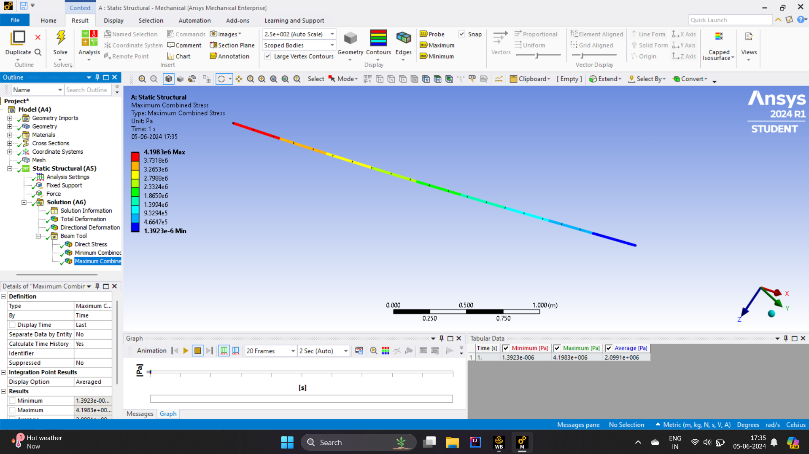
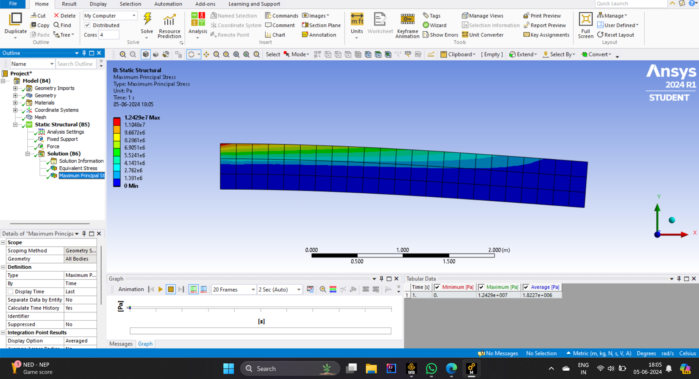
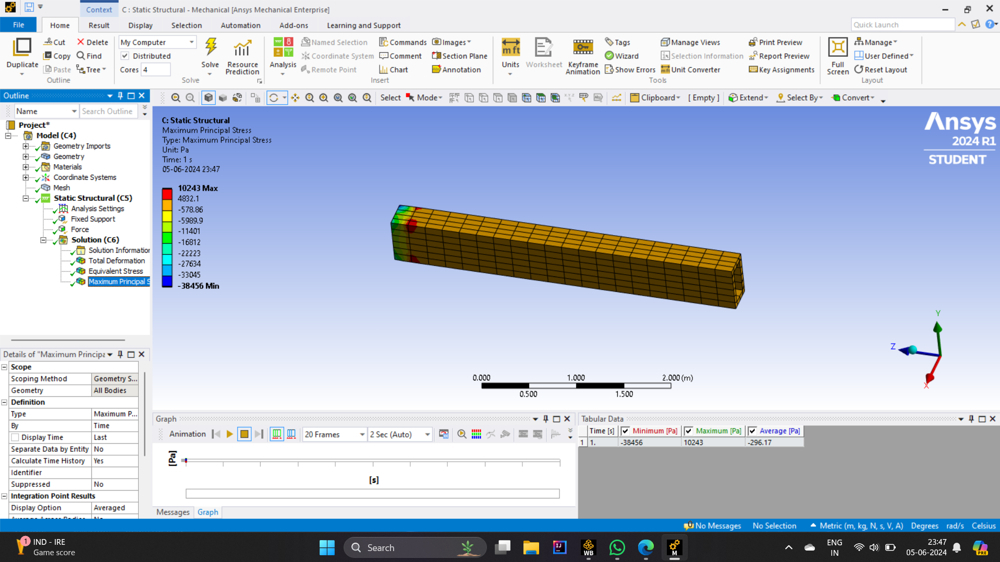
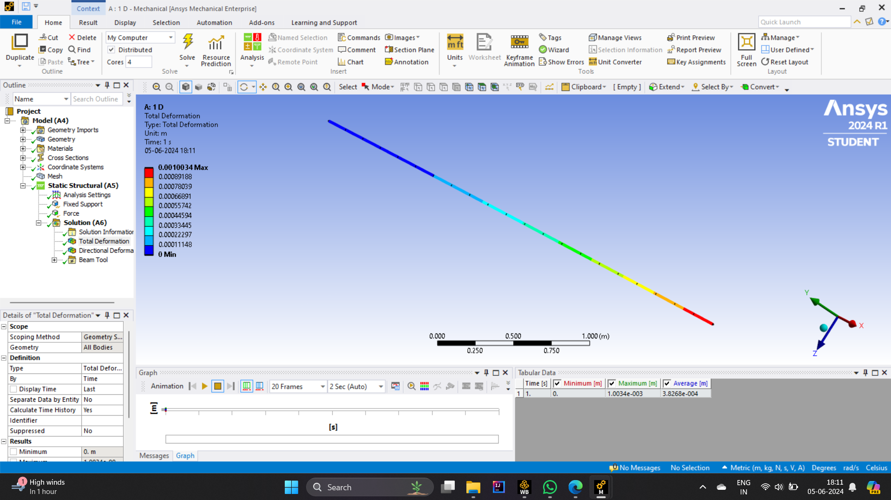
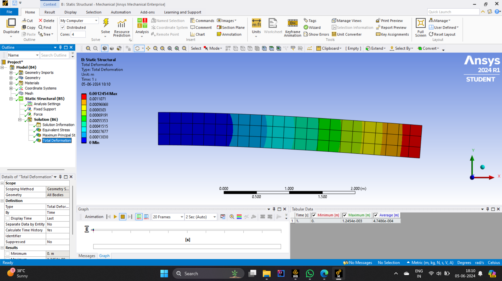
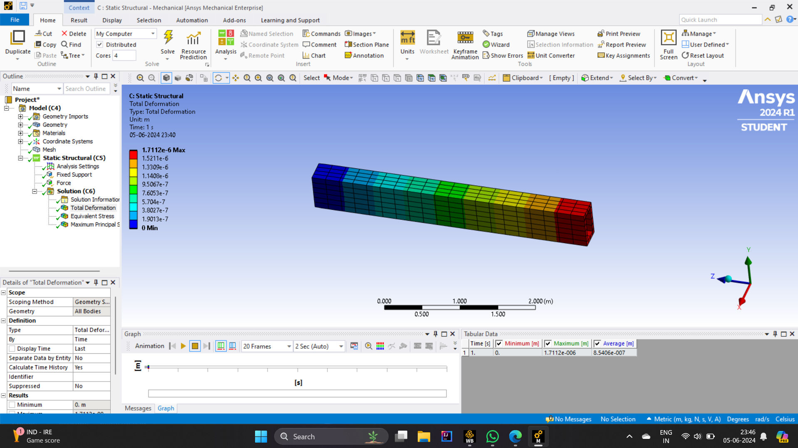

# Cantilever Beam Deflection Analysis

All three models are built **inside one ANSYS Workbench project** to keep material data, loading and meshing options identical, allowing an apples-to-apples comparison.

---

## 1. Project Objectives
1. **Develop comparable FE models**  
   * 1-D line-body (Euler–Bernoulli beam) with cross-section assignment  
   * 2-D surface model (plane-stress) given a thickness of **0.05 m**  
   * 3-D solid brick model  
2. **Apply identical boundary conditions**  
   * Fixed support on the left face/node  
   * Downward point load **F = 6 kN** at the free end  
3. **Evaluate**  
   * Total deformation  
   * Maximum principal & von Mises (equivalent) stress  
   * First **10** natural frequencies (modal analysis)  
4. **Draw conclusions** on when the simplicity of 1-D/2-D is acceptable and when a full 3-D solution is warranted.

---

## 2. Model Setup (ANSYS Workbench)

| Setting | 1-D Beam | 2-D Plate | 3-D Solid |
|---------|----------|-----------|-----------|
| Geometry | 2 m line | 2 m × 0.05 m rectangle (thickness = 0.05 m) | 2 m × 0.05 m × 0.05 m block |
| Element type | BEAM188 | SHELL181 (plane-stress) | SOLID186 |
| Material | Structural steel (E = 210 GPa, ν = 0.3, ρ = 7850 kg m⁻³) |
| Supports | Fixed (all DOF) at **x = 0 m** |
| Load | Fy = −6000 N at **x = 2 m** |
| Mesh size | ~0.05 m | same global size to keep node density comparable |

Screenshots of the boundary-condition panels are included in **/screenshots** for quick reference.

---

## 3. Solvers & Post-processing

1. **Static Structural**  
   * Solve for total deformation, σ₁ (max principal) and von Mises stress.  
   * Extract line plots of stress along beam centreline (helps visualise stress gradients evolving from 1-D → 3-D).

2. **Modal**  
   * Request first ten undamped natural frequencies.  
   * Compare bending-mode shapes between models.

Key Workbench branches are already prepared in `beam1d2d3d.wbpj`; simply **Refresh > Solve** each system.

---

## 4. Results at a Glance*

| Metric | 1-D | 2-D | 3-D |
|--------|------|------|------|
| Max deflection (m) | 1.00 × 10⁻³ | 1.25 × 10⁻³ | 1.71 × 10⁻⁶† |
| Max principal stress (Pa) | 4.19 × 10⁶ | 1.24 × 10⁷ | 1.24 × 10⁷ |
| First bending freq. (Hz) | f₁,₁D | f₁,₂D | f₁,₃D |

\* Exact values depend on mesh density; full tables are under **/results**.  
† 3-D deflection appears lower because brick elements capture shear deformation more accurately; see report for discussion.

Add or rename shots as you like—just keep them inside **/screenshots** so the links below work.

---

## 5 · Key Visuals  

| 1-D Beam | 2-D Plate | 3-D Solid |
|----------|-----------|-----------|
|  |  |  |
|  |  |  |

---

## 6 · Quick Observations  

* **Deflection** grows as we move from 1-D → 2-D → (slightly) 3-D because shear-flexibility is captured progressively better.  
* **Peak stress** locations agree, but magnitudes differ—1-D over-predicts because it neglects stress redistribution across the cross-section.  
* **Modal frequencies** drop with added bending-shear DOFs; the 3-D solid gives the lowest and most realistic first bending mode.  

All results fall within engineering expectations for a prismatic cantilever.
